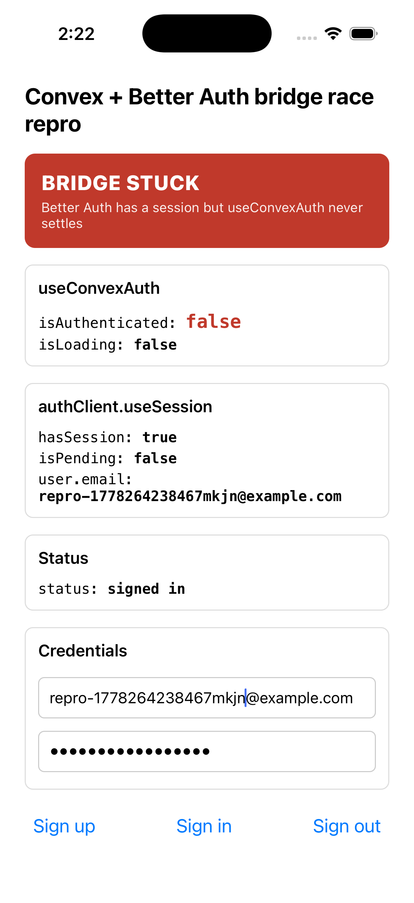
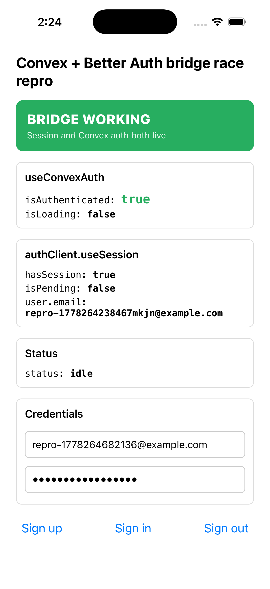

# convex-better-auth-368-repro

Minimal Expo app that reproduces the `useConvexAuth().isAuthenticated` race in `@convex-dev/better-auth@0.12.2` on Expo SDK 56 canary.

Filed as [`get-convex/better-auth#368`](https://github.com/get-convex/better-auth/pull/368). Root cause: [`expo/expo#45345`](https://github.com/expo/expo/pull/45345) dropped `@babel/plugin-transform-async-to-generator` from the Hermes V1 preset, which had been hiding a microtask race in the bridge's `fetchAccessToken`.

## What it looks like

| Vanilla `0.12.2` (broken) | Patched build (fixed) |
|---|---|
|  |  |

Same app, same Convex deployment, same Better Auth session. Only the `@convex-dev/better-auth` version in `package.json` differs.

## Symptom

After any auth state change (sign in, sign up, sign out):

- `authClient.useSession()` reflects the new state
- `/convex/token` returns a valid JWT
- `useConvexAuth().isAuthenticated` never settles, websocket stays paused

## Run

You need an iOS simulator (or device) and your own Convex deployment.

```bash
npm install
cp .env.example .env.local
# fill in EXPO_PUBLIC_CONVEX_URL, EXPO_PUBLIC_CONVEX_SITE_URL, CONVEX_DEPLOYMENT
npx convex dev      # one terminal, leave running
npm run ios         # another terminal
```

First launch shows the Expo dev client tutorial modal — tap "Continue" to dismiss. The app then auto-signs-up with `repro-${Date.now()}@example.com` and starts logging `[bridge]` lines to the metro console. The big colored banner at the top of the app reflects the bridge state in real time.

## Run both versions to see the contrast

The repo defaults to vanilla `0.12.2` (broken). To see the fix, swap one line in `package.json`:

```jsonc
// broken (vanilla npm)
"@convex-dev/better-auth": "0.12.2"

// fixed (patched build from PR #368)
"@convex-dev/better-auth": "file:./patches/convex-dev-better-auth-0.12.2.tgz"
```

After editing, do a clean install. Plain `npm install` won't swap because both sides advertise version `0.12.2` and npm thinks `node_modules` is already up to date:

```bash
trash node_modules package-lock.json && npm install
# or: rm -rf node_modules package-lock.json && npm install
# or: npm install --force
```

Then `npm run ios` again. The native binary doesn't need to rebuild (the change is JS-only) but the metro bundle picks up the new bridge code.

To swap back, reverse the package.json edit and run the clean install again.

## Expected output

**Broken** (vanilla `0.12.2`) — the banner stays red on `BRIDGE STUCK` after the session lands:
```
[bridge] {"useConvexAuth.isAuthenticated": false, "useConvexAuth.isLoading": true,  "useSession.hasSession": false, "useSession.isPending": true}
[bridge] {"useConvexAuth.isAuthenticated": false, "useConvexAuth.isLoading": true,  "useSession.hasSession": true,  "useSession.isPending": false}
[bridge] {"useConvexAuth.isAuthenticated": false, "useConvexAuth.isLoading": false, "useSession.hasSession": true,  "useSession.isPending": false}
```

**Fixed** (patched build) — the banner flips to green `BRIDGE WORKING` once the session lands:
```
[bridge] {"useConvexAuth.isAuthenticated": false, "useConvexAuth.isLoading": true,  "useSession.hasSession": false, "useSession.isPending": true}
[bridge] {"useConvexAuth.isAuthenticated": false, "useConvexAuth.isLoading": true,  "useSession.hasSession": true,  "useSession.isPending": false}
[bridge] {"useConvexAuth.isAuthenticated": true,  "useConvexAuth.isLoading": false, "useSession.hasSession": true,  "useSession.isPending": false}
```

The `Sign in` and `Sign out` buttons in the app exercise the same code path so you can watch the banner cycle across all three transitions.

## Versions pinned

- `expo` `56.0.0-canary-20260506-03817f5` (any post-`expo/expo#45345` canary)
- `react` `19.2.3`, `react-native` `0.85.3`
- `@convex-dev/better-auth` `0.12.2`
- `better-auth` `1.6.9`, `@better-auth/expo` `1.6.9`
- `convex` `^1.37.0`

No `babel.config.js` overrides. No `expo-modules-core` or `expo-jsi` pin.

`.npmrc` ships `legacy-peer-deps=true` so `npm install` accepts the canary prereleases against `@better-auth/expo`'s `expo-constants@">=17.0.0"` peer (npm semver excludes prereleases from normal ranges).

## Bisect (Hermes V1 plugin set vs `useConvexAuth.isAuthenticated`)

| Plugin set | Result |
|---|---|
| pre-#45345 baseline (regenerator wrapping for async) | true |
| post-#45345 baseline (native async) | false |
| post-#45345 + ALL 11 dropped transforms re-added globally | true |
| post-#45345 + ONLY `transform-async-to-generator` re-added globally | true |
| post-#45345 + 10 dropped transforms re-added EXCEPT `transform-async-to-generator` | false |
| post-#45345 + `transform-async-to-generator` applied to `node_modules/@convex-dev/better-auth/dist/react/` only | true |
| post-#45345 + `transform-async-to-generator` applied to `convex/*`, `better-auth/*`, `@better-auth/*` but NOT this bridge | false |
| post-#45345 + PR #368's source patch, no babel changes | true |

The bridge file is the entire surface. Convex client and Better Auth client are unaffected.

## Alternatives evaluated

Five other source-level shapes were tried in this repro and rejected:

1. `useState(cachedToken)` → `useRef`. Drops one re-render trigger. Better Auth's `Set-Cookie` store update still triggers a render via `useSession` and races. Doesn't fix.
2. `[sessionId]` → `[userId]` on `useCallback`. Doesn't rebuild on session rotation. First `setConfig` cycle still fails. Doesn't fix.
3. `.then((x) => x)` appended to the chain. Promise-of-same-realm short-circuits, no hop manifests. Doesn't fix.
4. Keep `async`, change `return pendingTokenRef.current` → `return await pendingTokenRef.current`. On V8 with await fusion this is a no-op. On Hermes V1 native async it doesn't add a microtask hop in practice. Doesn't fix.
5. Keep `async`, return `new Promise(...)` from inside the async body. Outer async wrapping short-circuits the inner thenable-adoption microtask. Doesn't fix.

Only dropping `async` and wrapping the entire body in `new Promise(executor)` works. The Promise constructor's thenable-adoption microtask is the spec-defined point where scheduling fires deterministically across engines.

## What the patch changes

`patches/PR-368.patch` is the source diff (single file, `src/react/index.tsx`). Drops `async`, wraps the body in `new Promise(executor)`. Twenty-six insertions, twenty-two deletions.

`patches/convex-dev-better-auth-0.12.2.tgz` is the built tarball from [`@ramonclaudio/convex-better-auth`](https://github.com/ramonclaudio/convex-better-auth) on branch `fix/react-bridge-hermes-async-race`. Rebuild:

```bash
git clone https://github.com/ramonclaudio/convex-better-auth.git
cd convex-better-auth
git checkout fix/react-bridge-hermes-async-race
npm install && npm run build
npm pack --pack-destination /path/to/this/repro/patches/
```

## License

MIT, by [Ramon Claudio](https://github.com/ramonclaudio).
